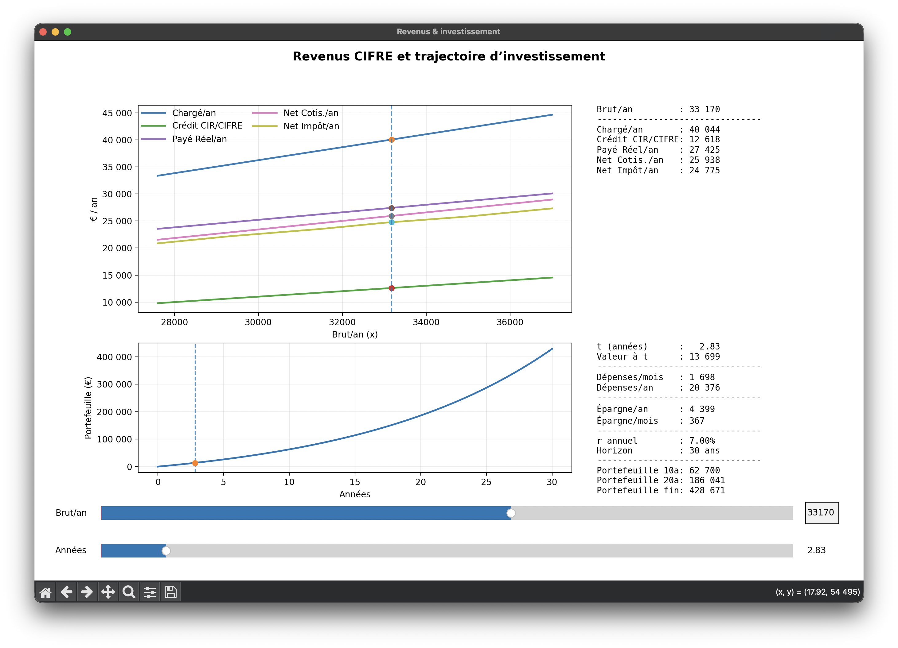

# Graphique interactif de revenus CIFRE et trajectoire d'investissement

Petit script Python pour explorer ~~une table de revenus annuels et projeter une trajectoire d’investissement à partir de l’épargne estimée~~ le dépit d'une thèse CIFRE.



## Fonctionnalités

- Charge une table (points discrets) avec :
  - `Chargé/an` (brut),
  - `Brut/an` (axe x),
  - `Net Cotis./an`,
  - `Net Impôt/an`.
  
  Points calculables avec le [simulateur URSSAF](https://mon-entreprise.urssaf.fr/simulateurs/salaire-brut-net).
- Calcule et affiche aussi :
  - `Crédit CIR + CIFRE` via la formule ci-dessous,
  - `Payé Réel/an` dérivé.
- Figure interactive :
  - **Haut** : séries (€ / an) vs `Brut/an` avec un **slider** + **textbox** (interpolation linéaire clamped).
  - **Bas** : **valeur de portefeuille** sur 30 ans (rendement annuel fixe) avec contributions mensuelles + **slider de curseur temporel**.

## Légende des quantités

- **CR** : *Coût réel employeur*.
- **C** : *Chargé employeur* (avant cotisations patronales, après JEI).
- **B** : *Brut employé* (avant cotisations salariales).
- **N** : *Net employé* (avant impôt sur le revenu — IR).
- **SN** : *Super net* (dans la poche).

## Définitions / formules

- **Crédit CIR + CIFRE** :
  - `Crédit CIR + CIFRE = (Chargé/an * 1.4 - 14000) * 0.3`
- **Payé Réel/an** :
  - `Payé Réel/an = Chargé/an - Crédit CIR + CIFRE`
- **Épargne annuelle** (utilisée pour l’investissement) :
  - `Épargne/an = max(0, Après IR SN/an - Dépenses/an)`
- Hypothèses investissement :
  - capitalisation **mensuelle** : `r_m = (1 + r_annuel)^(1/12) - 1`
  - versements **en fin de mois**
  - contributions négatives clampées à 0

## Exécution

### Dépendances
- Python 3.x
- `numpy`
- `matplotlib`

### Lancer
```bash
uv run main.py
